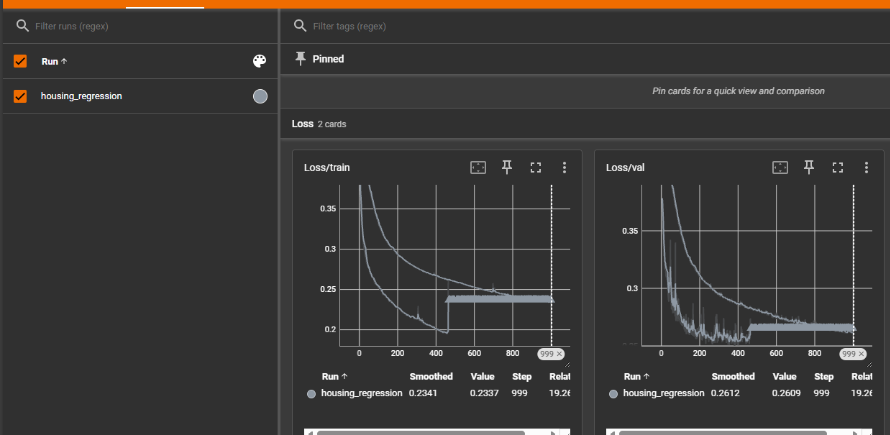
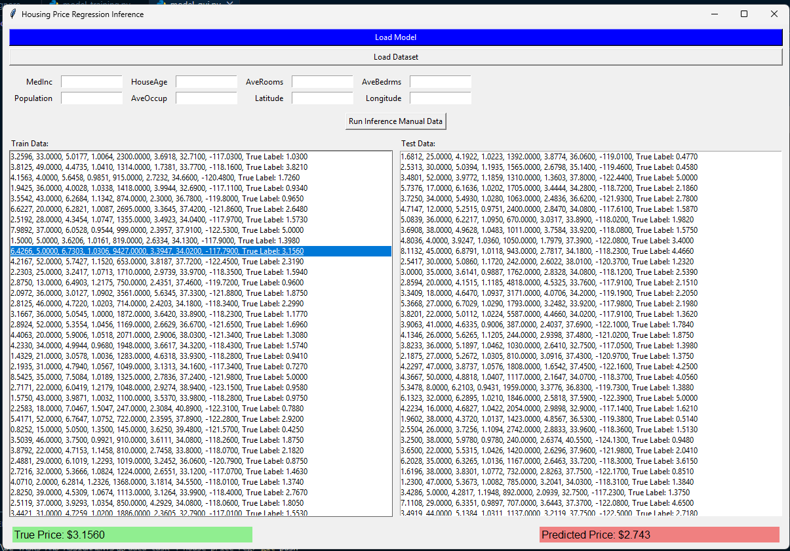
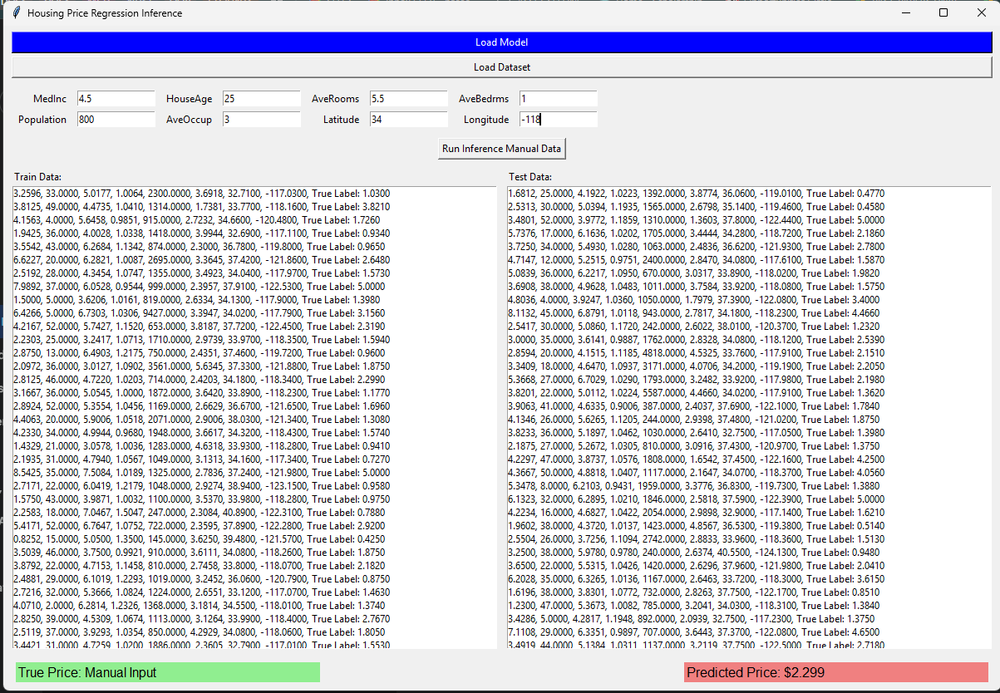

# Housing Price Regression — PyTorch Model + Inference GUI

A from-scratch PyTorch regression pipeline that predicts California housing prices from census-tract features, paired with a Tkinter desktop app for interactive inference on both dataset samples and manually entered values.

---

## 📌 Overview

This project implements a full supervised learning workflow: dataset loading and preprocessing, a custom feed-forward neural network, a training/validation loop with checkpointing, TensorBoard-based experiment tracking, and a standalone GUI for running inference on the trained model — all built from scratch in PyTorch rather than using a high-level training framework.

The target is the **California Housing dataset** (from `sklearn.datasets`), which contains 8 features per census district:

| Feature | Description |
| :--- | :--- |
| `MedInc` | Median income of the district |
| `HouseAge` | Median age of houses in the district |
| `AveRooms` | Average number of rooms per house |
| `AveBedrms` | Average number of bedrooms per house |
| `Population` | Total population of the district |
| `AveOccup` | Average occupancy per house |
| `Latitude` | Latitude coordinate of the district |
| `Longitude` | Longitude coordinate of the district |

The model predicts the district's median house value.

---

## 🧠 Model Architecture

A simple fully-connected regression network (`SimpleRegressionNet`):

```
Input (8 features)
   → Linear(8 → 50) → ReLU
   → Linear(50 → 100) → ReLU
   → Linear(100 → 1)
   → Predicted price
```

---

## 🏋️ Training

- **Optimizer:** SGD
- **Loss:** MSE (Mean Squared Error)
- **Epochs:** 1000
- **Split:** 80% train / 20% validation
- **Preprocessing:** Features standardized with `StandardScaler`, fitted on the training set and saved to `scaler.pkl` for consistent use at inference time
- **Checkpointing:** After every epoch, the model, optimizer state, and both losses are saved to `model.pt` — but only if validation loss improved, so the final checkpoint is always the best-performing one seen during training
- **Logging:** Training and validation loss are logged per epoch via `torch.utils.tensorboard.SummaryWriter` to `runs/housing_regression`

### Tuning the learning rate

The first training run used a learning rate of `0.01`. This was too aggressive for the architecture — gradients diverged and both losses shot to `NaN` by epoch ~470:

```
Epoch 450/1000 | Train Loss: 0.1953 | Val Loss: 0.2524
Epoch 460/1000 | Train Loss: 0.1957 | Val Loss: 0.2516
Epoch 470/1000 | Train Loss: nan    | Val Loss: nan
```

Dropping the learning rate to `0.001` fixed this completely. Training converged smoothly to a final **train loss of 0.2337** and **validation loss of 0.2609**:

```
Epoch 990/1000  | Train Loss: 0.2340 | Val Loss: 0.2641
Epoch 1000/1000 | Train Loss: 0.2337 | Val Loss: 0.2609
Training complete. Best model saved to 'model.pt'.
```

Training was run on **CPU**. Since the California Housing dataset is small, lightweight tabular data, CPU training handled all 1000 epochs comfortably without needing a CUDA-enabled PyTorch build.



---

## 🖥️ Inference GUI

A Tkinter desktop app (`model_gui.py`) for running the trained model interactively, with two inference modes:

1. **Dataset inference** — Load Model, then Load Dataset. Both the train and validation splits populate scrollable lists (each row shows the 8 raw features plus the true label). Clicking any row instantly scales the features with the saved scaler, runs them through the model, and displays the predicted price next to the ground-truth price.
2. **Manual inference** — Type any 8 feature values into the input boxes and click *Run Inference Manual Data* to get a prediction on a custom input.

**Dataset-row inference:**



**Manual input inference:**



---

## 📁 Project Structure

```
house_price_regression_w_gui/
├── docs/
│   ├── inference_dataset_row.png
│   ├── inference_manual_input.png
│   └── tensorboard_loss_curves.png
├── runs/
│   └── housing_regression/       # TensorBoard logs
├── environment.yml
├── model.pt                      # Best checkpoint (lowest val loss)
├── model_training.py             # Training + validation loop
├── model_gui.py                  # Tkinter inference GUI
├── scaler.pkl                    # Fitted StandardScaler
└── README.md
```

---

## 🛠️ Setup & Usage

**Environment:**
```bash
conda env create -f environment.yml
conda activate graded_task_4_house_price_reg
```

**Train from scratch** (optional — a trained `model.pt` and `scaler.pkl` are already included):
```bash
python model_training.py
```

**Track training with TensorBoard:**
```bash
tensorboard --logdir runs
```

**Run the inference GUI:**
```bash
python model_gui.py
```
Then click **Load Model** and select `model.pt`, click **Load Dataset** to browse samples, or enter your own 8 feature values manually.

---

## ✅ Assignment Requirements Coverage

This project was built to a defined spec: implement the pipeline from scratch following a provided template, covering dataset fetching, model implementation, training/validation loops, checkpointing, TensorBoard logging, and an inference GUI.

| Requirement | Status |
| :--- | :---: |
| Fetch dataset, extract features/targets | ✅ |
| Custom `SimpleRegressionNet` architecture | ✅ |
| Training loop (forward pass, MSE loss, backprop) | ✅ |
| Validation loop | ✅ |
| Checkpointing (save only on val-loss improvement) | ✅ |
| TensorBoard logging | ✅ |
| Inference GUI: load model, load dataset, click-to-infer, manual entry | ✅ |
